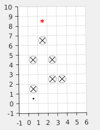

## ELEC5660 Introduction to Aerial Robotics: Project 1 Phase 3

In phase 1 and 2, a controller and trajectory generator are implemented respectively. Phase 3 will focus on path
finding and obstacle avoidance.

### A* Path Search
Two simple 2D grid maps which contain the obstacles, start and target locations will be provided. You need to
implement a 2D A\* path search method to find a optimal path with safty guarantee. Then you need to connect all
the path points using your previous trajectory generator and control your drone to follow the trajectory.
If you design a 3D grid map and extend your A\* method to 3D case, you will get bonus points.

### Tutorial
The 2 provided grid maps are shown below. The black dot, circles, red * represent start point, obstacles and
goal respectively. The environments are devided into 1 x 1m grids, each grid is represent by the coordinates of the
right-top corner. We provide the code to pre-process these map into 2D map array in [path_from_A_star.m](/L4-%20Time%20%26%20Motion%20Trajectory%20Generation/proj1phase3/code/path_from_A_star.m).

<p align="center">
  
  
</p>

### Sturcture of the Simulator

The simulation code is almost the same with [proj1phase2](/L4-%20Time%20%26%20Motion%20Trajectory%20Generation/proj1phase2/) but a [path_from_A_star.m](/L4-%20Time%20%26%20Motion%20Trajectory%20Generation/proj1phase3/code/path_from_A_star.m).

```bash
+ code
  + readonly #supposed to be read only
    - quadModel_readonly.m #parameters of a 500g quadrotor
    - quadEOM_readonly.m #dynamics model of quadrotor.
    - run_trajectory_readonly.m #solve the equation of motion, receive desired trajectory,run your controller, iteratively. visualization is also included.
  + utils #useful functions.
  - controller.m #You have alredy had a good controller in proj1phase1
  - trajectory_generator.m #You have alredy had a good trajectory_generator in proj1phase2
  - path_from_A_star.m: #What you need to work with. The code which pre-processes obstacle into a grid map has been given. You need to generate path points using A* and feed the points into trajectory_generator.m
  - test_trajectory.m #main entry.
```
